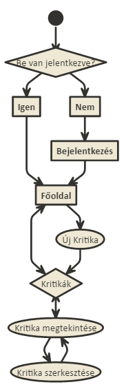

# Dokumentáció
##Film kritikák
Készítette: Akopjan Alex

###1.	Követelményanalízis
#####1.1.	Célkitűzés, projektindító dokumentum
A program legfőbb célja jól átláthatóan, és érthetően megjeleníteni az adott filmekhez tartozó filmkritikát egy webes vastagkliens, azaz egyoldali alkalmazás felhasználásával. Az adatok védelme érdekében legyen lehetőség regisztrációra, majd bejelentkezésre. Bejelentkezett felhasználó a filmek listáját megtekintheti, filmkritikákkal bővítheti, meglévő elemeket törölhet. 

######Funkcionális követelmények:
* Regisztrációra
* Bejelentkezés
* Csak bejelentkezett felhasználók által elérhető funkciók
  - új kritika írása a listába*
  - a meglévő kritikák szerkesztésére
  - a meglévő kritikák törlésére

######Nem funkcionális követelmények:
*	**Könnyű áttekinthetőség:** Színekkel műfaj szerint csoportosítás
*	**Használhatóság:** Könnyű áttekinthetőség, ésszerű elrendezés, könnyen kezelhetőség
*	**Megbízhatóság:** Jelszóval védett funkciók, és a jelszavak védelme a háttérben. Hibásan bevitt adatok esetén a program jól láthatóan jelezzen a felhasználónak, és emelje ki a hibás beviteli mezőket. A jól bevitt adatok maradjanak az űrlapban.
*	**Karbantarthatóság:** könnyen lehessen bővíteni, a különböző típusú fájlok külön csoportosítva, ésszerűen legyenek felbontva, a könnyebb fejleszthetőség miatt

#####1.2.	Szakterületi fogalomjegyzék

**Műfajok:**
* **Vígjáték:** Vicces, komikus elemekből álló korhatár nélkül megtekinthető film.
* **Akció:** Olyan film amiben hagyományosan megtalálhatók a robbanások, az ökölharcok, a lövöldözések, egyéb akció jelenetek.
* **Horror:**  Olyan alkotás, amelyben a főhősöknek szembe kell nézniük a borzalmakkal, és gyakran áldozat lesz belőlük. A filmek végét általában nem zárja megnyugtató lezárás, győzelem vagy happy end.
* **Sci-fi:**  Olyanfilm, amely legtöbbször valódi vagy képzeletbeli tudomány(ok)nak a társadalomra, vagy egyes egyénekre gyakorolt hatását mutatja be.

**Rendező:** A film művészeti és dramatikus részeinek elkészítését vezeti.

#####1.3.	Használatieset-modell, funkcionális követelmények

**Vendég**: Csak a publikus oldalakat éri el

*	Főoldal
*	Bejelentkezés/ Regisztráció

**Bejelentkezett felhasználó**: A publikus oldalak elérésén felül egyéb funkciókhoz is hozzáfér.

*	Új filmkritika felvétele
*	Meglévő filmkritika megtekintése
*	Meglévő filmkritikaszerkesztése
*	Meglévő filmkritika törlése

Vegyünk példának egy egyszerű folyamatot:

**Meglévő filmkritika szerkesztése:**

1.	A felhasználó az oldalra érkezve, bejelentkezik vagy regisztrál
2.	Bejelentkezés után megtekintheti a filmkritikákat kilistázó oldalt, ahol kiválaszthatja filmkritikát.
3.	Megnyomja a „Read Critic” feliratú gombot
4.	A megtekintés oldalon elolvashatja a filmkritikát, és amennyiben ő adta hozzá szerkesztheti a ceruza ikonnal jelzett gombra kattintva.
5.	Szerkesztés oldalon felviszi az új adatokat
6.	Save critic gombra kattintva elmenti a változásokat vagy a Delete critic gombbal törölheti

