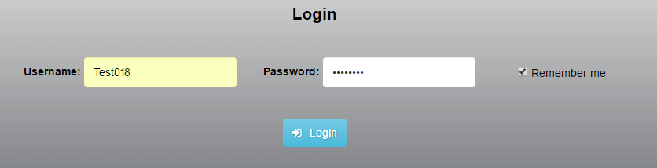

# Dokumentáció
##Film kritikák
Készítette: Akopjan Alex

###1.	Követelményanalízis
#####1.1.	Célkitűzés, projektindító dokumentum
A program legfőbb célja jól átláthatóan, és érthetően megjeleníteni az adott filmekhez tartozó filmkritikát egy webes vastagkliens, azaz egyoldali alkalmazás felhasználásával. Az adatok védelme érdekében legyen lehetőség regisztrációra, majd bejelentkezésre. Bejelentkezett felhasználó a filmek listáját megtekintheti, filmkritikákkal bővítheti, meglévő elemeket törölhet. 

######Funkcionális követelmények:
* Regisztrációra
* Bejelentkezés
* Csak bejelentkezett felhasználók által elérhető funkciók
  - új kritika írása a listába*
  - a meglévő kritikák szerkesztésére
  - a meglévő kritikák törlésére

######Nem funkcionális követelmények:
*	**Könnyű áttekinthetőség:** Színekkel műfaj szerint csoportosítás
*	**Használhatóság:** Könnyű áttekinthetőség, ésszerű elrendezés, könnyen kezelhetőség
*	**Megbízhatóság:** Jelszóval védett funkciók, és a jelszavak védelme a háttérben. Hibásan bevitt adatok esetén a program jól láthatóan jelezzen a felhasználónak, és emelje ki a hibás beviteli mezőket. A jól bevitt adatok maradjanak az űrlapban.
*	**Karbantarthatóság:** könnyen lehessen bővíteni, a különböző típusú fájlok külön csoportosítva, ésszerűen legyenek felbontva, a könnyebb fejleszthetőség miatt

#####1.2.	Szakterületi fogalomjegyzék

**Műfajok:**
* **Vígjáték:** Vicces, komikus elemekből álló korhatár nélkül megtekinthető film.
* **Akció:** Olyan film amiben hagyományosan megtalálhatók a robbanások, az ökölharcok, a lövöldözések, egyéb akció jelenetek.
* **Horror:**  Olyan alkotás, amelyben a főhősöknek szembe kell nézniük a borzalmakkal, és gyakran áldozat lesz belőlük. A filmek végét általában nem zárja megnyugtató lezárás, győzelem vagy happy end.
* **Sci-fi:**  Olyanfilm, amely legtöbbször valódi vagy képzeletbeli tudomány(ok)nak a társadalomra, vagy egyes egyénekre gyakorolt hatását mutatja be.

**Rendező:** A film művészeti és dramatikus részeinek elkészítését vezeti.

#####1.3.	Használatieset-modell, funkcionális követelmények

**Vendég**: Csak a publikus oldalakat éri el

*	Főoldal
*	Bejelentkezés/ Regisztráció

**Bejelentkezett felhasználó**: A publikus oldalak elérésén felül egyéb funkciókhoz is hozzáfér.

*	Új filmkritika felvétele
*	Meglévő filmkritika megtekintése
*	Meglévő filmkritikaszerkesztése
*	Meglévő filmkritika törlése

Vegyünk példának egy egyszerű folyamatot:

**Meglévő filmkritika szerkesztése:**

1.	A felhasználó az oldalra érkezve, bejelentkezik vagy regisztrál
2.	Bejelentkezés után megtekintheti a filmkritikákat kilistázó oldalt, ahol kiválaszthatja filmkritikát.
3.	Megnyomja a „Read Critic” feliratú gombot
4.	A megtekintés oldalon elolvashatja a filmkritikát, és amennyiben ő adta hozzá szerkesztheti a ceruza ikonnal jelzett gombra kattintva.
5.	Szerkesztés oldalon felviszi az új adatokat
6.	Save critic gombra kattintva elmenti a változásokat vagy a Delete critic gombbal törölheti

###2.	Tervezés

#####2.1.	Architektúra terv

######2.1.1. Komponensdiagram

.png)

######2.1.2. Oldaltérkép:

**Publikus:**
* Főoldal
* Bejelentkezés/Regisztráció

**Bejelentkezett:**
* Főoldal
* Új kritika felvétele
* Kritikák
  * Kritika megtekintése 
    * Kritika szerkesztése
      * Szerkesztett kritika mentése 
      * Kritika törlése

######2.1.3. Végpontok

* GET/: főoldal
* GET/loginSignUp: bejelentkező oldal
* POST/login: bejelentkező adatok felküldése
* GET/logout: kijelentkező oldal
* GET/critics/list: kritika lista oldal
* GET/createCritic: új kritka felvétele
* POST/addCategory: új kategória felvétele
* POST/createCritic: új kritka felvételéhez szükséges adatok felküldése
* GET/vieWCritic/:id : kritika adatok
* POST/vieWCritic/:id : kritika adatok kilistázása
* GET/editCritic/:id : kritika módosítása
* POST/editCritic/:id : kritika módosítása, adatok felküldése
* GET/deleteCritic/:id : kritika törlése

#####2.2. Felhasználói-felület modell

######2.2.1.Oldalvázlatok:

**Bejelentkezés/Regisztrálás**

**Regisztrálás**

**Bejelentkezés**

**Főoldal**

**Új Kritika**

**Kritika lista**

**Kritika megtekintése**

.
.
.

**Kritika szekesztése**

###**3. Könyvtárstruktúrában lévő mappák funkciójának bemutatása**
+ app->Http : Ajax-os funkciókhoz szükséges kiegészítések
  * routes.js :  további szükséges végpontok felvétele
+ app->Http->Controllers
  * CriticsController.js : 
    * ajaxDelete : a hirdetés Ajax-os törlését végzi
  * HomeController.js : 
    * ajaxLogin : belépés Ajax-szal
+ public->scripts : a funkciókhoz szükséges kiegészítések
  * delete.js : Ajax-os törlés biztosítása
  * popup_login.js : bejelentkező felület pop-up ablakkal való megvalósítása
  * popup_login.js : regisztrációs felület pop-up ablakkal való megvalósítása

+ resources->views : kliensoldali funkciók működéséhez szükséges kiegészítések
Az alábbi fájlok módosításai a fenti scriptek importálásában változtak.
Ezen kívül az űrlapok küldés gombja le van tiltv addig, amíg a felhasználó ki nem töltötte az összes olyan mezőt, ami a fejlesztő által kötelezően kitöltendő kategóriában van meghatározva.
  * createCritic.njk 
  * critics.njk
  * editCritic.njk
  * layout.njk
  * main.njk
  * viewCritic.njk
  * loginSignUp.njk

###**4. Tesztelés**

Maga a tesztelés az órán is használt Selinium IDE-val történt.
A teszteléshez tartozó mentett fájlok a *test* nevű mappában találhatók.
A tesztelés során az alapvető funkciók lettek ellenőrizve.

* Bejelentkezés : *login.html*
* Új kritika hozzáadása : *new_critic.html*
* Hirdetés módosítása: *edit.html*
* Hirdetés törlése : *delete.html*
* Kijelentkezés: *logut.html*

###**5. Felhasználó dokumentáció**

####**5.1. A futtatáshoz ajánlott hardver-, szoftver konfiguráció**
+ **Futtatáshoz szükséges operációs rendszer:** Tetszőlegesen bármilyen operációs rendszer használható
+ **A futtastáshoz szükséges hardver:** Az operációs rendszerek szerint van megadva
+ **Egyéb:** Internetes böngésző, JavaScript, illetve az alkalmazás által használt össze kiegészítőket tartalmazó fájlok telepítése ajánlott

####**5.2. Telepítés lépései: hogyan kerül a Githubról a célgépre a program, hogyan kell elindítani**
+ **1. lépés**
Egy konzol, azaz Parancssor nyitása a gépen
+ **2. lépés**
*git clone https://github.com/Alex1842/alkfejlBeadando.git* parancs kiadása
+ **3. lépés**
*git config --global url."https://".insteadOf git://* parancs kiadása
+ **4. lépés**
*npm install* parancs kiadása
+ **5. lépés**
.env.example fájl átnevezése .env-re
+ **6. lépés**
*npm run dev* parancs kiadása
+ **7. lépés**
Böngészőben *localhost:3333* megnyitása

